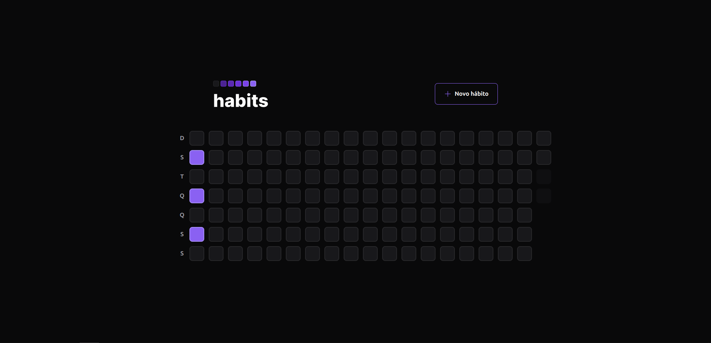
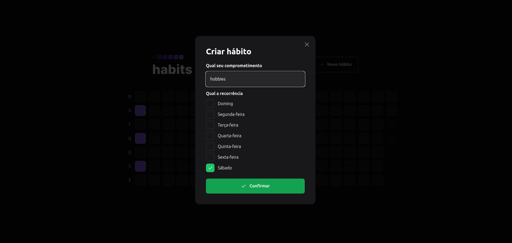

### Check out the front-end web app
https://github.com/macielvini/habits

### How to run

1. Clone this repository
2. Install all dependencies with `npm i`
3. Create and configure the `.env` file using the .env.example file
4. Run all migrations with `npx prisma migrate dev`
5. Run `npm run dev` to start the server

### Screenshots

